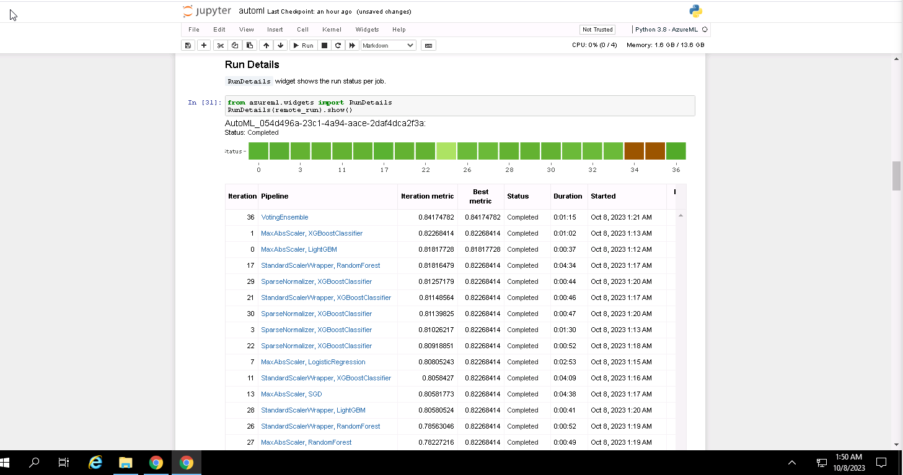
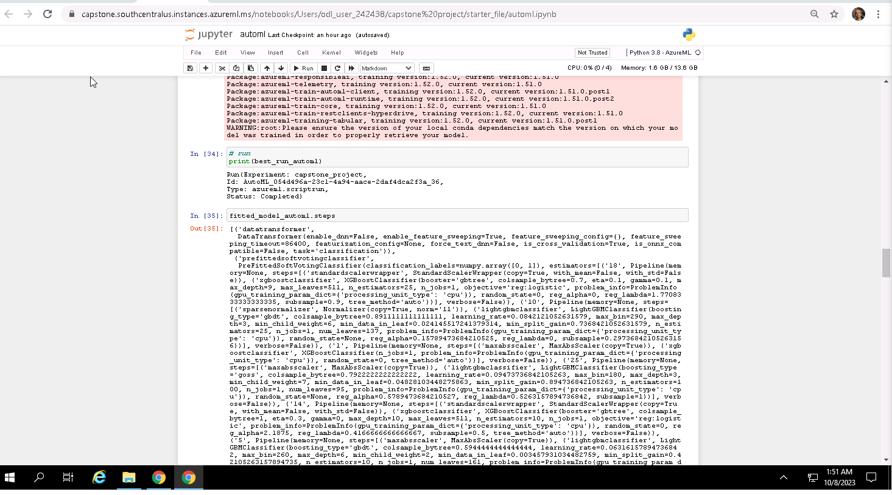
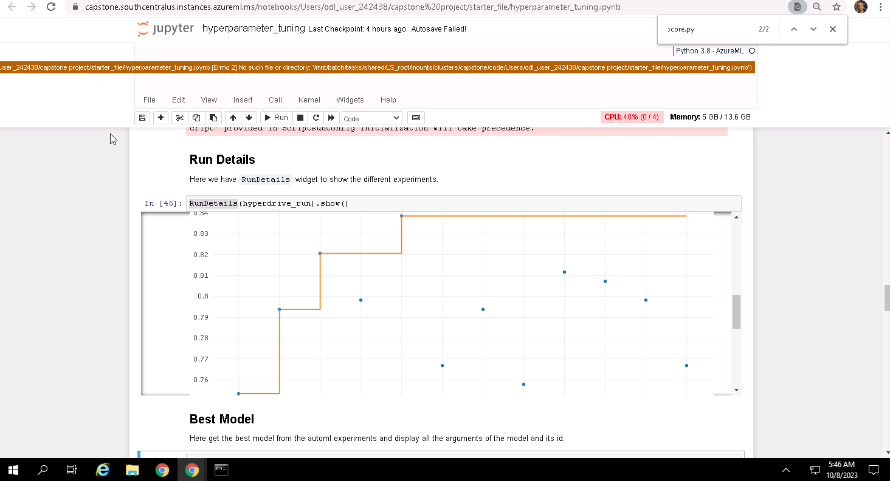
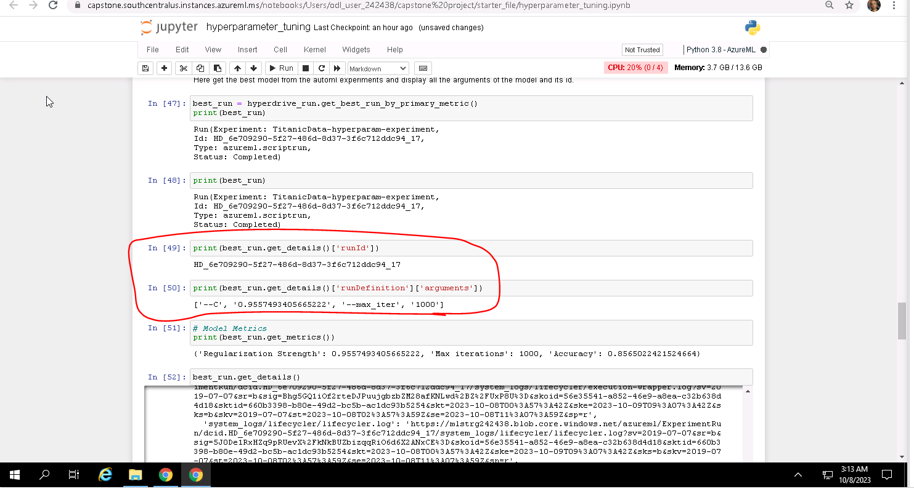
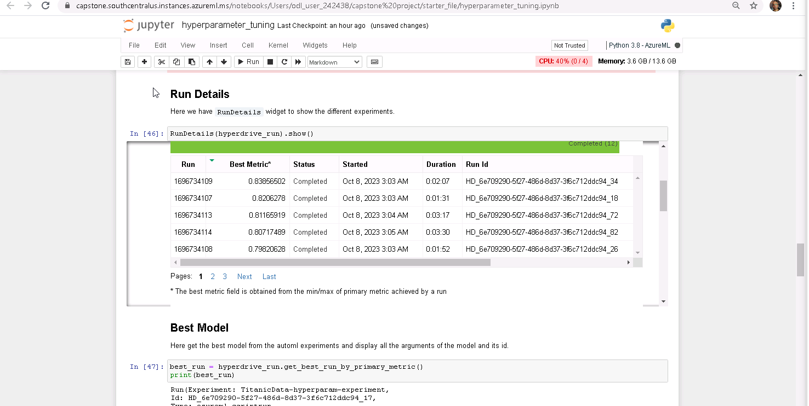
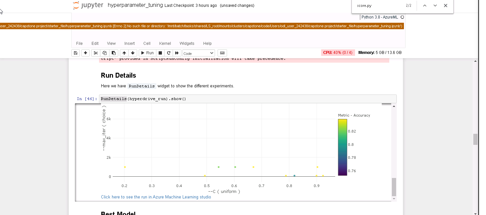
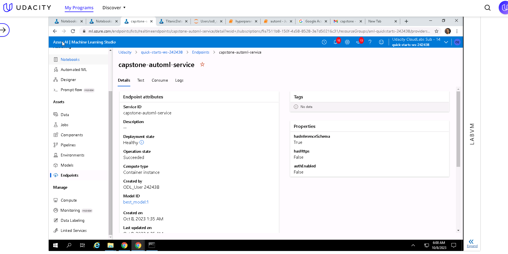

- [Capstone Project - Azure Machine Learning Engineer Nanodegree](#capstone-project---azure-machine-learning-engineer-nanodegree)

# Capstone Project 
# Azure Machine Learning Engineer Nanodegree

I used [Kaggle Titanic Challenge](https://www.kaggle.com/c/titanic) dataset, which consist the data of the famous Titanic shipwreck, showing some passengers were more likely to survive than others. The dataset from Kaggle platform presents information about 871 passengers and a column that states if they have survived or not. The ultimate goal is to build a model that predicts which passengers survived the Titanic shipwreck. The Titanic Dataset is commonly referred to as the "hello world" of data science.

Here we do this in two different ways:
1) Using AutoML;
2) Using a customized model and tuning its hyperparameters with HyperDrive

We then compare the performance of both the models and deploy the best performing model.
The deployment is done using the Azure Python SDK, and creates an endpoint that can be accessed through an HTTP REST API. The step makes it possible for any new data to be evaluated by the best model thorugh the service.

## Dataset

### Overview

The dataset chosen for this project is the one from [Kaggle Titanic Challenge](https://www.kaggle.com/c/titanic). 

In the famous Titanic shipwreck, some passengers were more likely to survive than others. The dataset presents information about 871 passengers and a column that states if they have survived or not.

Here we use only the "training" data of the original challenge because this is the data with the "Survived" label, which is necessary for the Supervised Learning algorithms that are used in this project.

Find below the defintion of some variables:

Variable | Definition | Key
------------ | ------------- | -------------
Survived | Survival | 0 = No, 1 = Yes
Age	| Age | in years
Fare | Passenger fare | Value (float)
Cabin | Cabin number |  string
Q | Port of Embarkation	is Q = Queenstown | 0 = No, 1 = Yes
S | Port of Embarkation	is S = Southampton | 0 = No, 1 = Yes
male | Is male. If not, we consider the passenger female. | 0 = No, 1 = Yes

### Task
In this project, I used ML Stuido to train a model with the best possible **Accuracy** to classify if a passenger survives or not.
For this, we use two approaches:

1) **Using AutoML**:
In this approach, we provide the dataset to AutoML and it automatically does the featurization, tries different algorithms, and test the performance of many different models. 

2) **Using HyperDrive**: 
In this case, we test only a single algorithm and create different models by providing different hyperparameters. The chosen algorithm is Logistic Regression using the framework SKLearn.
Unlike AutoML, here we need to manually perform feature scaling, normalization and select interesting columns for our model.

In both cases, the best performing model created during runs can be saved and deployed, and its parameters can be checked both in the Azure ML portal and in the run logs.

The features that are used in this experiment are the ones described in the data dictionary above. However, in the case of the HyperDrive, we manually remove the columns "Name", "Ticket", and "Cabin" which are not supported by the Logistic Regression classifier.

## Automated ML
For the AutoML run, first we create a compute cluster to run the experiment. In this cluster, we provide 2 to 10 machines with the **"STANDARD_DS12_V2"** configuration.
Because we have 10 nodes in our cluster, we can run up to 9 concurrent iterations in our experiment (1 node is meant to be used by the "parent" experiment).

The constructor of `AutoMLConfig` class takes the following parameters:
* `compute_target`: cluster where the experiment jobs will run;
* `task`: type of ML problem to solve, set as `classification`;
* `experiment_timeout_minutes`: 20;
* `enable_early_stopping`: makes it possible for the AutoML to stop jobs that are not performing well after a minimum number of iterations; 

The `accuracy` metric might be misleading when the training data has very few samples of one of the classes, which is **not** the case in Titanic dataset. The distribution of classes on it is about 40% and 60% of samples in each class. Moreover, accuracy is a straightforward metric and easy to understand. This is the main reason why it has been chosen in this experiment.

Because AutoML is an automated process that might take a long time to use many resources, it is a good idea to enable the early stopping of model training jobs. When the training takes a long time, it can lead to higher costs. The tool is then able to kill jobs that are not performing well, leading to better resource usage

Featurization enables techniques of feature engineering to be applied to the dataset, enhancing the learning process. Examples of featurization steps are imputing missing values, generation of more features, dropping features with no variance, among others. `Data guardrails` is a feature that helps to identify automatically potential issues with the data, like missing values or class imbalance. Setting the `featurization` option to `auto` specifies that, as part of preprocessing, data guardrails and featurization steps are to be done automatically.

### Results
The best model produced relied on the **Voting Ensemble** algorithm, from the SKLearn framework. This model had an **accuracy** of **84,17%**.

Voting Ensemble uses multiple models as inner estimators and each one has its unique hyperparameters.
#### AutoML Run Details widget

#### AutoML Best Model Run

#### AutoML Best Model Run Properties

## Hyperparameter Tuning
Here we are using a Logistic Regression model coming from the SKLearn framework to classify if a passenger would survive or not in the Titanic shipwreck.
Although logistic regression assumes a linear relationship between input and output, which is rarely the real case, it is easy to implement, interpret, and very efficient to train and classify unknown records.
So, this algorithm has been chosen because it would allow us to experiment quickly in the Azure ML environment.

Hyperdrive is used to sample different values for two algorithm hyperparameters:
* `C`: Inverse of regularization strength
* `max_iter`: Maximum number of iterations taken for the solvers to converge

My choice here was to sample the values using Random Sampling, in which hyperparameter values are randomly selected from the defined search space. `C` is chosen randomly in uniformly distributed between **0.001** and **1.0**, while `max_iter` is sampled from one of the three values: **1000, 10000, and 100000**.

### Results
Surprisingly, the best Logistic Regression model in the HyperDrive run performed even better than the best one in the AutoML run. This model had an **accuracy** of **83,85%**.

The parameters used by this classifier are the following:
* C = 0.8893892118773127
* Max iterations = 1000

#### HyperDrive Run Details widget

#### HyperDrive Best Model Run

#### Service of HyperDrive model with "Healthy" deployment state

